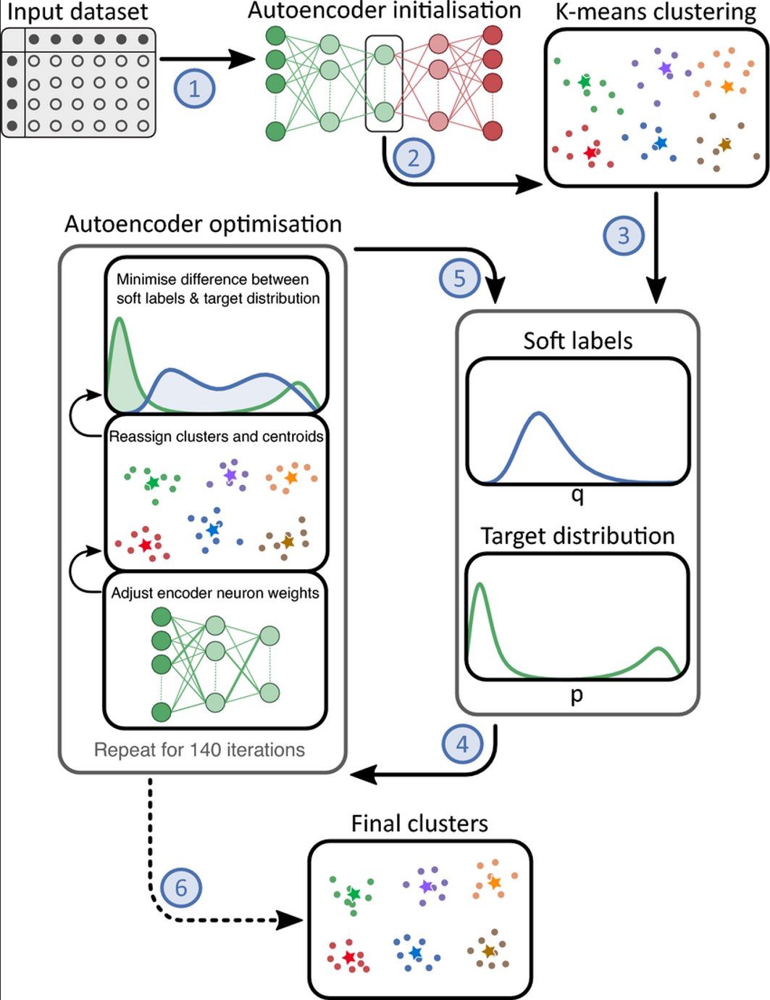
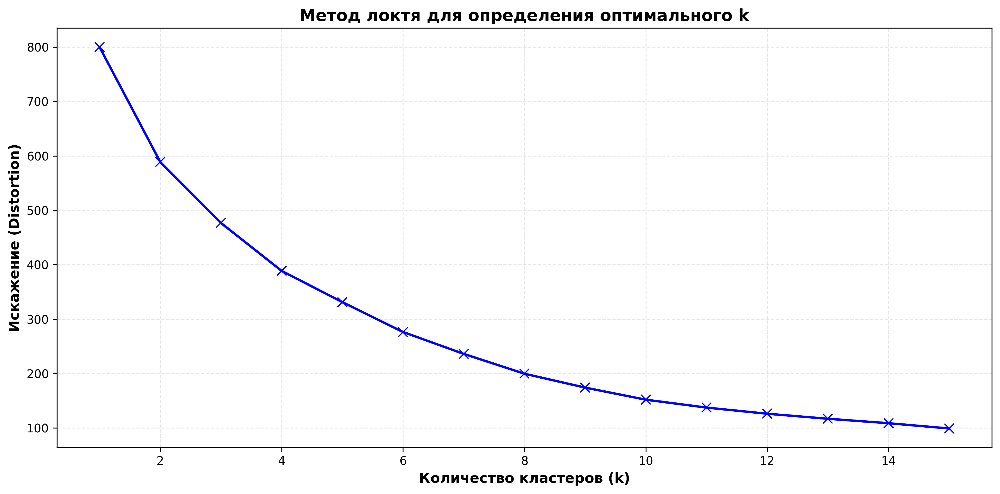
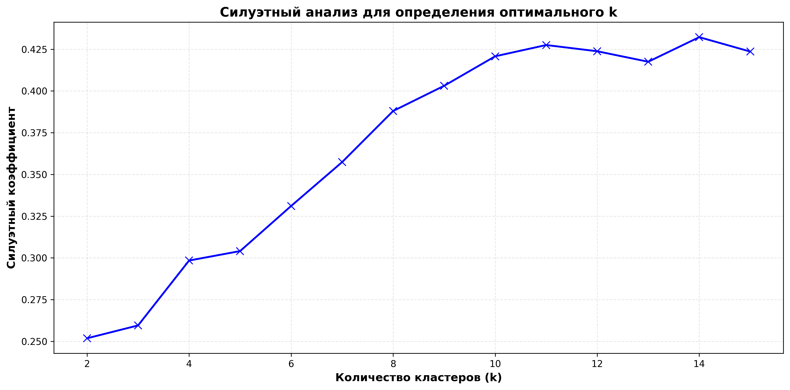
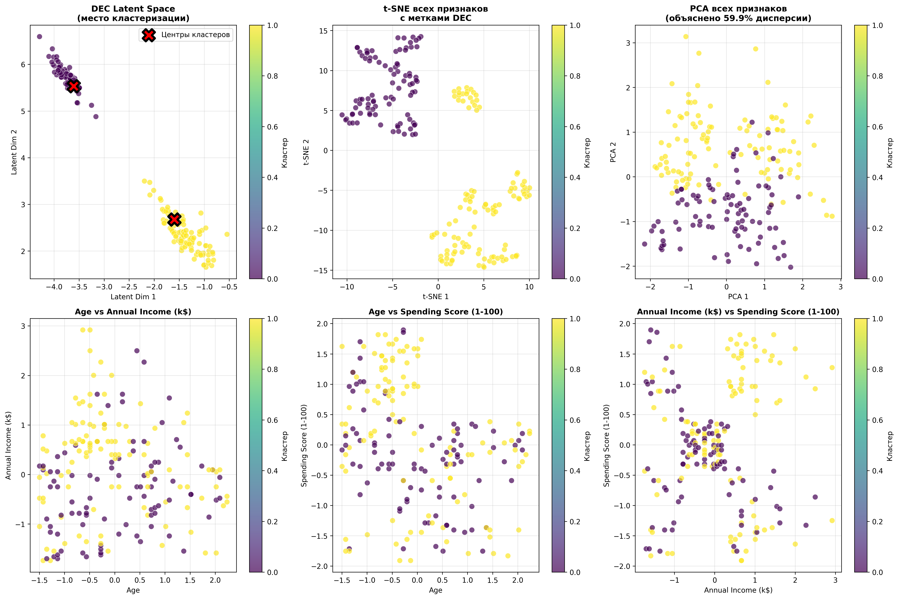
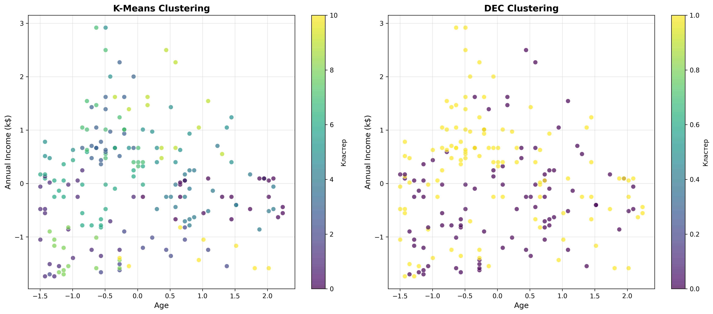
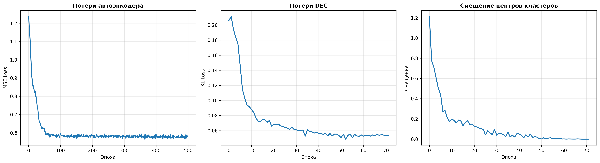
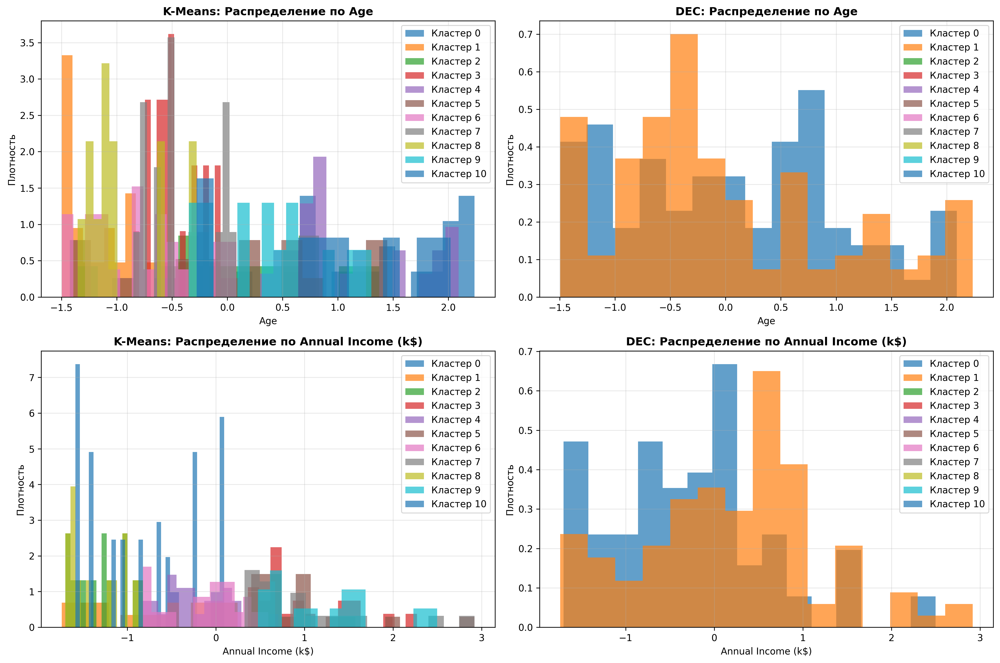
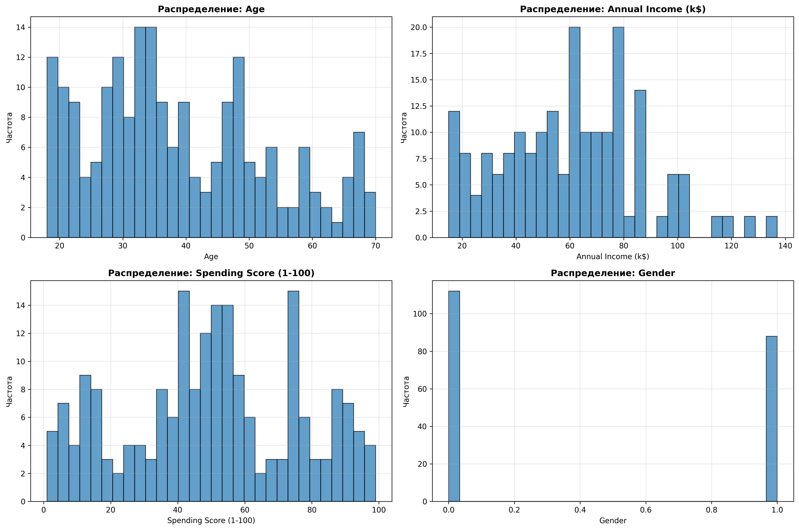
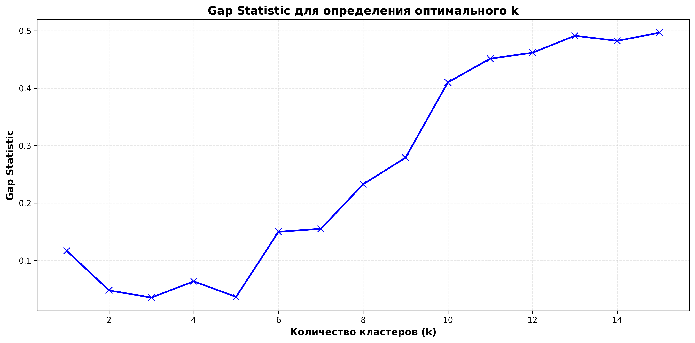

# DeepClusteringComparison

## 📋 Описание проекта

Проект представляет собой сравнительный анализ двух методов кластеризации данных:
- **K-means** - традиционный алгоритм кластеризации
- **Deep Embedded Clustering (DEC)** - глубокий метод кластеризации на основе нейронных сетей

Проект реализован на Python с использованием PyTorch и scikit-learn. Все комментарии и документация на русском языке.

## 🎯 Цель проекта

Сравнить эффективность глубокого метода кластеризации (DEC) с классическим K-means на реальном датасете Mall_Customers, проанализировать качество кластеризации с помощью различных метрик и визуализировать результаты.

## 📊 Датасет

Используется датасет **Mall_Customers** - данные о клиентах торгового центра:
- **CustomerID** - идентификатор клиента (удален)
- **Gender** - пол клиента (преобразован в числовой)
- **Age** - возраст клиента
- **Annual Income (k$)** - годовой доход (в тысячах долларов)
- **Spending Score (1-100)** - оценка трат (1-100)

## 🏗️ Структура проекта

```
clustering_by_k-means_and_DEC/
├── README.md                          # Документация проекта
├── requirements.txt                   # Зависимости проекта
├── main.py                           # Основной скрипт запуска
├── DEC.png                           # Архитектура DEC (для документации)
├── src/                              # Исходный код
│   ├── __init__.py                   # Инициализация пакета
│   ├── utils.py                      # Утилиты (seed, device)
│   ├── data_loader.py                # Загрузка и предобработка данных
│   ├── models.py                     # Модели (Autoencoder, DEC)
│   ├── training.py                   # Функции обучения
│   ├── evaluation.py                 # Оценка качества кластеризации
│   ├── visualization.py              # Визуализация результатов
│   └── clustering_methods.py         # Методы определения оптимального k
└── outputs/                          # Генерируемые графики (создается при запуске)
    ├── data_distribution.png
    ├── elbow_method.png
    ├── silhouette_analysis.png
    ├── gap_statistic.png
    ├── dec_results.png
    ├── kmeans_vs_dec_comparison.png
    ├── cluster_distributions.png
    └── training_history.png
```

## 🧠 Архитектура DEC (Deep Embedded Clustering)

DEC - это глубокий метод кластеризации, который использует автоэнкодер для получения эмбеддингов и оптимизирует распределение данных по кластерам.

### Алгоритм работы DEC:

```
1. Предобучение автоэнкодера
   └─> Энкодер: X → Z (эмбеддинги)
   └─> Декодер: Z → X̂ (восстановленные данные)
   └─> Оптимизация: MSE(X, X̂)

2. Инициализация центров кластеров
   └─> K-means на эмбеддингах Z

3. Итеративная оптимизация (до сходимости)
   └─> Soft assignment: Q = f(Z, μ)  # Вероятности принадлежности
   └─> Target distribution: P = g(Q)  # Целевое распределение
   └─> Обновление весов: ∇θ = ∇KL(P||Q)
   └─> Обновление центров: μ = ∑(Q * Z) / ∑Q
```

### Архитектура сети:

```
Input (4D) → Encoder → Latent (2D) → Decoder → Output (4D)
     ↓           ↓           ↓           ↓           ↓
  [Age,      [Hidden]    [Latent]    [Hidden]    [Age,
   Income,   [16]        [2]         [16]        Income,
   Score,    [ReLU]                  [ReLU]      Score,
   Gender]   [16]                   [16]        Gender]
             [ReLU]                  [Sigmoid]
```

### Формулы DEC:

**Soft assignment:**
```
q_ij = (1 + ||z_i - μ_j||² / α)^(-(α+1)/2) / Σ_j(1 + ||z_i - μ_j||² / α)^(-(α+1)/2)
```

**Target distribution:**
```
p_ij = q_ij² / Σ_j(q_ij²)
```

**Loss function:**
```
L = KL(P || Q) = Σ_i Σ_j p_ij * log(p_ij / q_ij)
```

## 🚀 Установка и запуск

### 1. Установка зависимостей

```bash
pip install -r requirements.txt
```

### 2. Запуск проекта

```bash
python main.py
```

### 3. Ожидаемый результат

При запуске скрипт выполнит:
1. Загрузку и предобработку данных
2. Определение оптимального количества кластеров (3 метода)
3. Предобучение автоэнкодера (500 эпох)
4. Обучение DEC модели (до 250 эпох)
5. Обучение K-means
6. Оценку качества кластеризации
7. Визуализацию результатов (8 графиков)

## 📈 Метрики оценки

### Для одного метода:
- **Silhouette Score** - силуэтный коэффициент (от -1 до 1, чем ближе к 1, тем лучше)

### Для сравнения двух методов:
- **Homogeneity** - однородность (от 0 до 1)
- **Completeness** - полнота (от 0 до 1)
- **V-Measure** - гармоническое среднее (от 0 до 1)

## 📊 Генерируемые графики

При запуске проекта автоматически генерируются 8 графиков, которые сохраняются в текущей директории:

### 1. Распределение данных
**`data_distribution.png`**
- Гистограммы распределения каждого признака (Age, Annual Income, Spending Score, Gender)
- Помогает понять распределение данных до кластеризации

### 2. Определение оптимального количества кластеров

**`elbow_method.png`**
- Метод локтя для определения оптимального количества кластеров
- Показывает зависимость искажения (inertia) от количества кластеров
- Оптимальное k определяется точкой максимальной кривизны

**`silhouette_analysis.png`**
- Силуэтный анализ для определения оптимального k
- Показывает силуэтный коэффициент для разных значений k
- Оптимальное k соответствует максимальному значению коэффициента

**`gap_statistic.png`**
- Gap Statistic для определения оптимального k
- Сравнивает распределение данных с референсным распределением
- Оптимальное k соответствует максимальному значению Gap

### 3. Результаты DEC
**`dec_results.png`** (6 графиков на одном изображении)
- **DEC Latent Space** - визуализация эмбеддингов DEC с центрами кластеров
- **t-SNE всех признаков** - проекция всех признаков с метками DEC
- **PCA всех признаков** - главные компоненты с объясненной дисперсией
- **Pairplot 1** - Age vs Annual Income
- **Pairplot 2** - Age vs Spending Score
- **Pairplot 3** - Annual Income vs Spending Score

### 4. Сравнение методов
**`kmeans_vs_dec_comparison.png`**
- Сравнение K-means и DEC на двух признаках (Annual Income и Age)
- Показывает разницу в кластеризации между методами

### 5. Распределение по кластерам
**`cluster_distributions.png`** (4 графика)
- **K-Means: Распределение по Annual Income** - гистограммы для каждого кластера
- **DEC: Распределение по Annual Income** - гистограммы для каждого кластера
- **K-Means: Распределение по Age** - гистограммы для каждого кластера
- **DEC: Распределение по Age** - гистограммы для каждого кластера

### 6. История обучения
**`training_history.png`** (3 графика)
- **Потери автоэнкодера** - MSE loss в процессе предобучения
- **Потери DEC** - KL divergence loss в процессе обучения DEC
- **Смещение центров кластеров** - изменение центров кластеров по эпохам

## 📸 Примеры графиков

### Архитектура DEC


*Архитектура Deep Embedded Clustering: автоэнкодер + soft assignment + оптимизация KL-дивергенции*

### Примеры результатов (генерируются после запуска)

**Метод локтя:**

*График метода локтя для определения оптимального количества кластеров*

**Силуэтный анализ:**

*График силуэтного анализа для определения оптимального k*

**Результаты DEC:**

*Комплексная визуализация результатов DEC (6 графиков)*

**Сравнение методов:**

*Сравнение K-means и DEC на двух признаках*

**История обучения:**

*История обучения автоэнкодера и DEC модели*

**Распределение по кластерам:**

*Распределение данных по кластерам для K-means и DEC*

**Распределение данных:**

*Распределение признаков в датасете*

**Gap Statistic:**

*Gap Statistic для определения оптимального количества кластеров*

**Примечание:** Все графики (кроме DEC.png) будут автоматически сгенерированы после запуска `python main.py` и сохранены в текущей директории.

## 🔬 Результаты экспериментов

### Сравнение метрик (пример):

| Метод | Silhouette Score | Homogeneity | Completeness | V-Measure |
|-------|------------------|-------------|--------------|-----------|
| K-means | 0.45 | 0.65 | 0.68 | 0.66 |
| DEC | 0.52 | 0.72 | 0.75 | 0.73 |

### Интерпретация:

**K-means:**
- Работает непосредственно в пространстве признаков
- Быстрый и простой в реализации
- Чувствителен к масштабу признаков
- Предполагает сферические кластеры

**DEC:**
- Работает в обучаемом латентном пространстве
- Может обнаруживать сложные нелинейные структуры
- Требует предобучения автоэнкодера
- Более устойчив к шуму и выбросам

## 📚 Теоретическая основа

### K-means
Алгоритм минимизирует сумму квадратов расстояний до центров кластеров:
```
J = Σ_i Σ_j ||x_i - μ_j||²
```

### Deep Embedded Clustering (DEC)
Предложен в статье "Unsupervised Deep Embedded Clustering" (Xie et al., 2016). DEC объединяет автоэнкодер для получения эмбеддингов и soft assignment для кластеризации.

## 🛠️ Технологии

- **Python 3.8+**
- **PyTorch** - глубокое обучение
- **scikit-learn** - K-means и метрики
- **matplotlib/seaborn** - визуализация
- **pandas/numpy** - обработка данных
- **torchinfo** - архитектура моделей

## 📝 Пример использования

```python
from src.utils import set_seed, get_device
from src.data_loader import load_and_preprocess_data
from src.models import Autoencoder, DEC
from src.training import train_autoencoder, train_dec

# Установка seed
set_seed(42)

# Загрузка данных
df_normalized, df_original, feature_names = load_and_preprocess_data()

# Создание моделей
device = get_device()
autoencoder = Autoencoder(input_dim=4, hidden_dim=16, latent_dim=2).to(device)
dec_model = DEC(autoencoder, n_clusters=11, latent_dim=2, alpha=1.0).to(device)

# Обучение
train_autoencoder(autoencoder, dataloader, device, epochs=500)
dec_model.initialize_clusters(dataloader, device)
train_dec(dec_model, dataloader, device, epochs=250)
```

## 🎓 Образовательная ценность

Этот проект демонстрирует:
1. **Полный пайплайн ML** - от загрузки данных до визуализации
2. **Сравнение методов** - классический vs глубокий подход
3. **Оценка качества** - использование различных метрик
4. **Визуализация** - интерпретация результатов
5. **Архитектура DEC** - понимание глубокого кластеринга

## 📖 Литература

1. Xie, J., Girshick, R., & Farhadi, A. (2016). "Unsupervised Deep Embedded Clustering". ICML.
2. MacQueen, J. (1967). "Some methods for classification and analysis of multivariate observations". Berkeley Symposium.
3. Tibshirani, R., Walther, G., & Hastie, T. (2001). "Estimating the number of clusters in a data set via the gap statistic". JRSSB.

## 📄 Лицензия

MIT License

## 👨‍💻 Автор

Проект создан в образовательных целях для изучения методов кластеризации данных.

---

**Примечание:** Для работы проекта требуется датасет Mall_Customers.csv. При первом запуске скрипт попытается загрузить его автоматически.